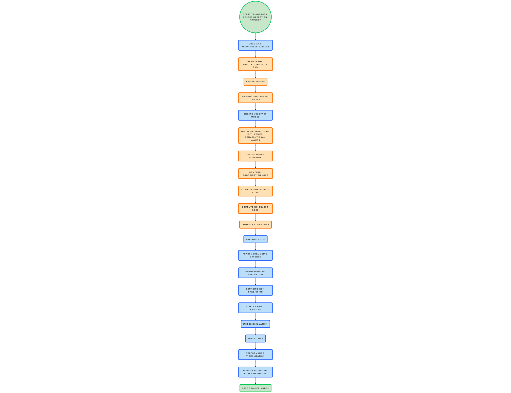

# YOLO V1 from Scratch

This project contains a raw implementation of the YOLOv1 (You Only Look Once) object detection algorithm from scratch, based on the paper [YOLO: You Only Look Once](https://arxiv.org/abs/1506.02640v5).

## Table of Contents

- [Introduction](#introduction)
- [Usage](#usage)
- [File Description](#file-description)
- [WorkFlow](#workflow)
- [Flowchart](#flowchart)

## Introduction

YOLOv1 is a real-time object detection and classification alsogorithm which creates a bounding box across image/frames.

## Usage


To use the YOLOv1 object detection model in this project, follow these steps:

### 1. Clone the Repository

```bash
git clone https://github.com/kunalkushwahatg/yolov1_from_scratch.git
cd yolov1_from_scratch
```

### 2. Install Dependencies


```bash
pip install -r requirements.txt
```

### 3. Prepare the Dataset

Place your images and their corresponding annotation XML files in the `dataset/` directory. The images should be labeled using the PASCAL VOC format.

### 4. Train the Model

To train the YOLOv1 model on your dataset, run the following command:

```bash
python main.py --files dataset/train_data.pkl
```

This will start the training process. You can adjust the parameters (like learning rate, batch size) in the `config.py` file.

### 5. Evaluate the Model

Once training is complete, you can evaluate the model's performance using the saved weights:

```bash
python evaluate.py --model_path models/model.pth --data_path dataset/test_data.pkl
```

### 6. Visualize Predictions

To visualize predictions with bounding boxes, use the following command:

```bash
python visualize.py --image_path dataset/sample_image.jpg --model_path models/model.pth
```

### 7. Save the Model

The trained model will be saved as `model.pth` in the `models/` directory.


## File Description 
- `config.py` - Defines essential configuration parameters for model training, including image size, training settings, and transformations.
- `dataset_preparation.py` - Processes images and annotations to generate labeled data, storing it in a pickle file for training.
- `dataset.py` - Defines a custom PyTorch dataset class for loading and transforming image-label pairs.
- `evaluate.py` - Implements evaluation utilities for computing loss, making predictions, visualizing results, and saving training progress as GIFs.
- `get_labels.py` - Processes image annotations, generates grid-based labels for object detection, and extracts bounding box predictions.
- `helper_functions.py` - Provides utility functions for reading XML annotations and resizing images while adjusting bounding box coordinates.
- `main.py` - Loads the dataset, splits it into training and validation sets, initializes the model, trains it, and saves the trained model.
- `model.py` - Implements the YOLO-based convolutional neural network for object detection, defining its architecture and forward pass.
- `train.py` - Handles model training, computes loss using YOLO loss function, updates weights, evaluates performance, and saves training progress.
- `visualization.py` - Contains methods for visualizing bounding boxes and grids on images, as well as reading images and drawing bounding boxes from XML annotations.
- `yolo_fast.py` - Implements a simplified version of YOLO with fewer convolutional layers and filters, aimed at improving inference speed while maintaining accuracy.
- `yolo_loss.py` - Defines the custom YOLO loss function, combining coordination loss, confidence loss, no-object loss, and class loss for object detection training.

### Workflow 
This project implements a custom YOLO-based object detection model using PyTorch. It includes a simplified YOLO architecture (`YoloModel`) that improves inference speed by reducing the number of convolutional layers. The dataset is processed with custom functions to read annotations and resize images, creating grid-based labels. The model is trained using a custom loss function (`YoloLoss`), which combines four components: coordinate loss, confidence loss, no-object loss, and class loss. The training process includes batch-wise loss calculation, optimization, and model evaluation. The project also visualizes predictions with bounding boxes and grid overlays using the `Visualize` class.

### Flowchart


